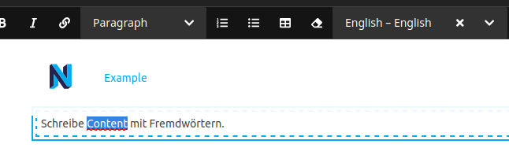

[](//packagist.org/packages/prgfx/neos-textpartlanguage)

# Prgfx.Neos.TextPartLanguage

This package allows editors to tag selected text with a language, helping assistive technology with pronunciation, implementing the [WCAG 3.1.2 Language of Parts](https://www.w3.org/TR/UNDERSTANDING-WCAG20/meaning-other-lang-id.html) specification.

```
composer require prgfx/neos-textpartlanguage
```

This plugin is based on [@ckeditor/ckeditor5-language](https://github.com/ckeditor/ckeditor5/tree/master/packages/ckeditor5-language), making the necessary adaptations to use it with the Neos backend.



## Usage
Enable it for a node property:
```yaml
'Neos.Demo:Content.Text':
  properties:
    text:
      ui:
        inline:
          editorOptions:
            textLanguages: true
```
Or set specific properties:
```yaml
'Neos.Demo:Content.Text':
  properties:
    text:
      ui:
        inline:
          editorOptions:
            textLanguages:
              languages:
                de: German
                en: My.Package:Main:textLanguages.languages.en
                fr: French
                gr: ~
              placeholder: My.Package:Main:textLanguages.placeholder
```

## Configuration
By default, this plugin provides the system-languages configured in `Neos.Neos.userInterface.availableLanguages`, but different default values can be set at `Neos.Neos.Ui.frontendConfiguration.'Prgfx.Neos.TextPartLanguage:languages'`.

## Appearance
In the backend this plugin underlines all marked text-elements through a stylesheet included in `prototype(Neos.Neos:Page).head.stylesheets.textPartLanguage` which you might disable, if you don't require it or want to apply custom styling.
